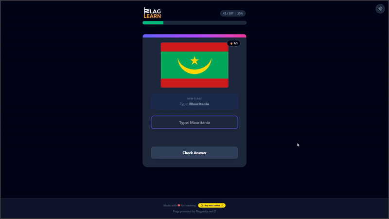

# 🌍 Flag Learn

An interactive geography quiz game built with React, TypeScript, and Tailwind CSS. Test your knowledge of world flags or start learning now!

---



---

### 🚀 **Live Demo:** [https://flag-learn-red.vercel.app/](https://flag-learn-red.vercel.app/)

---

## ✨ Features

- **Learn Mode:** Guess flags in batches of 10. Prioritizes major countries first.
- **Practice Mode:** Review flags you've already mastered.
- **Progress Tracking:** Saves your streaks and mastery status locally.
- **Dark Mode:** Fully supported dark/light theme.
- **Animations:** Smooth transitions using Framer Motion.

---

## 🛠️ Tech Stack

- React (Vite)
- TypeScript
- Tailwind CSS
- Framer Motion
- Lucide React (Icons)

---

## 🚀 How to run locally

1. Clone the repository
   ```bash
   git clone https://github.com/zadzora/flag-learn.git
Install dependencies

Bash
npm install
Run the development server

Bash
npm run dev

---

## ☕ Support
If you like this project, you can buy me a coffee!

[](https://coff.ee/davidzadzora)

---

## 📄 License
This project is licensed under the MIT License. Flags provided by Flagpedia.net.