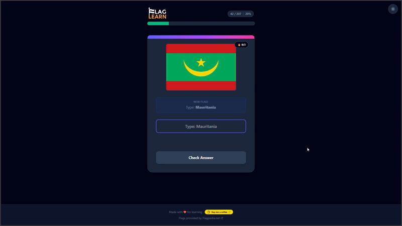

# 🌍 Flag Learn (Geography & Astronomy Quiz)

An interactive educational quiz game built with React, TypeScript, and Tailwind CSS. Master world geography, flags, capitals, and even the night sky through engaging game modes and spaced repetition!

---



---

### 🚀 **Live Demo:** [https://www.flaglearn.eu/](https://www.flaglearn.eu/)

---

## ✨ Game Modes

- **📖 Single Player:** Learn World Flags, US State Flags, and World Capitals in batches of 10. Prioritizes spaced repetition.
- **📅 Daily Flagle:** A new mystery flag to guess every single day.
- **🗺️ Map Locator:** Interactive SVG world map. Find the correct country by clicking on its territory.
- **⚔️ PvP Battle:** Challenge your friends in real-time multiplayer flag battles.
- **🏆 Ultimate Mode:** The ultimate test! Locate the country on the map, then type its name, and finally type its capital in a "sudden death" format.
- **🌫️ Blur Mode:** Can you recognize flags when they are highly blurred?
- **✨ Constellations:** Learn to identify the 88 modern constellations by their star patterns. Features beautiful mythological art upon mastery!

## 🛠️ Features

- **Progress & Streaks:** Saves your learning progress, streaks, and mastered items locally.
- **Practice Mode:** Review items you've already mastered with a built-in timer and mistake counter.
- **Dark & Light Mode:** Fully supported themes across all modes and interactive maps.
- **Smooth Animations:** Powered by Framer Motion.

---

## 💻 Tech Stack

- React (Vite)
- TypeScript
- Tailwind CSS
- Framer Motion
- React Simple Maps (Interactive SVG maps)
- Lucide React (Icons)

---

## 🚀 How to run locally
Clone the repository
   ```bash
   git clone [https://github.com/zadzora/flag-learn.git](https://github.com/zadzora/flag-learn.git)
```
Install dependencies
```
npm install
```
Run the development server
```
npm run dev
```

## ☕ Support
If you like this project, you can buy me a coffee!

## 📄 License & Credits
This project is licensed under the MIT License.

Flags provided by Flagpedia.net.

Constellation mythological art provided by NOIRLab/NSF/AURA.